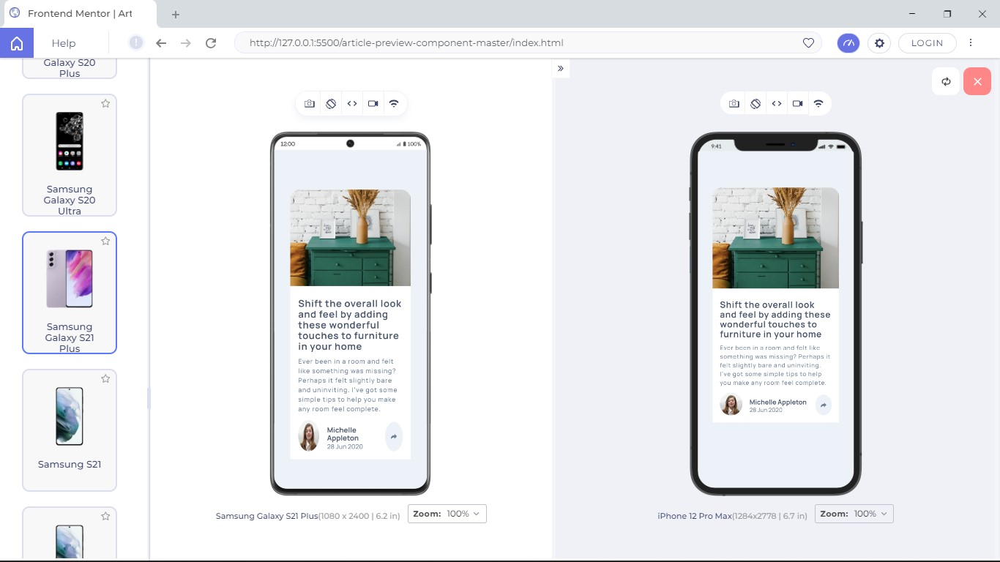
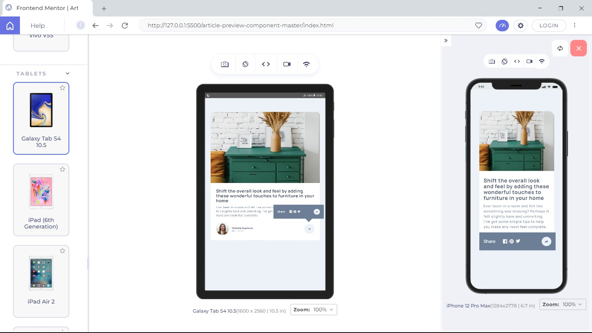
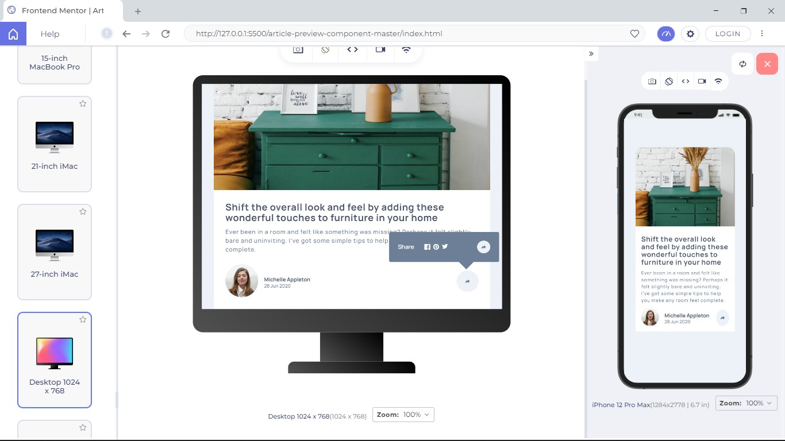

# Frontend Mentor - Article preview component solution

This is a solution to the [Article preview component challenge on Frontend Mentor](https://www.frontendmentor.io/challenges/article-preview-component-dYBN_pYFT). 

## Table of contents

- [Overview](#overview)
  - [The challenge](#the-challenge)
  - [Screenshot](#screenshot)
  - [Links](#links)
- [My process](#my-process)
  - [Built with](#built-with)
  - [What I learned](#what-i-learned)
  - [Continued development](#continued-development)
  - [Useful resources](#useful-resources)
- [Author](#author)
- [Acknowledgments](#acknowledgments)

## Overview

### The challenge

Users should be able to:

- View the optimal layout for the component depending on their device's screen size
- See the social media share links when they click the share icon

### Screenshot

 

 

### Links

- Solution URL: [Add solution URL here](https://your-solution-url.com)
- Live Site URL: [Add live site URL here](https://your-live-site-url.com)

## My process

### Built with

- Semantic HTML5 markup
- CSS custom properties
- Flexbox
- CSS Grid
- Mobile-first workflow
- Javascript

### What I learned

i was really proud of my css skills and how well it is developing.
i was able to make it responsive for all screen size.
i was also proud i was able to make the message icon that pops up when the share-icon is clicked.

i learned about event listener is javascript and was able to apply the click event to solve this challenge

### Continued development

## Author

- Github - [Olaoye Praise](https://github.com/Praixx)
- Email - [Olaoye Praise](praix1y@gmail.com)
- Twitter - [@Praixx_](https://www.twitter.com/Praixx_)

## Acknowledgments

